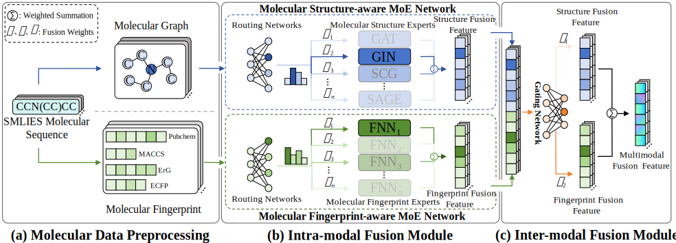

# ANMSDTI

- HMMP-MPP HMMF-MPP performs molecular property prediction via hierarchical multi-modal fusion with mixture-of-experts, enabling adaptive intra- and inter-modal fusion for enhanced generalization.

- The framework of HMMF-MPP is as follows:

<br>
<div align=left>  </div>

## Install via Conda
```bash
# Clone the environment
conda env create -f env.yml
# Activate the environment
conda activate HMMF-MPP
```

## Run the Codes

```bash
python main_gnn_classificaiton.py --task bace
```
